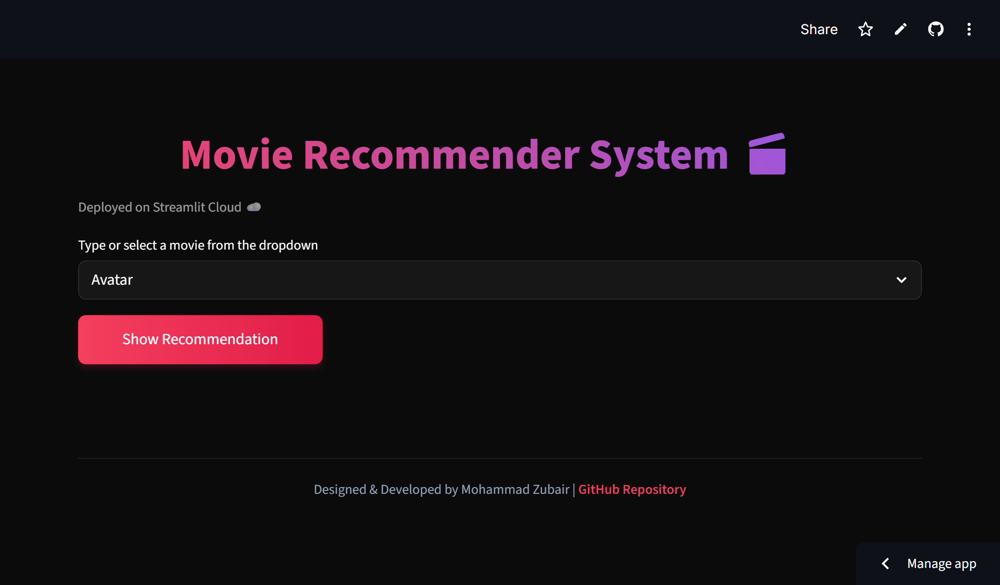
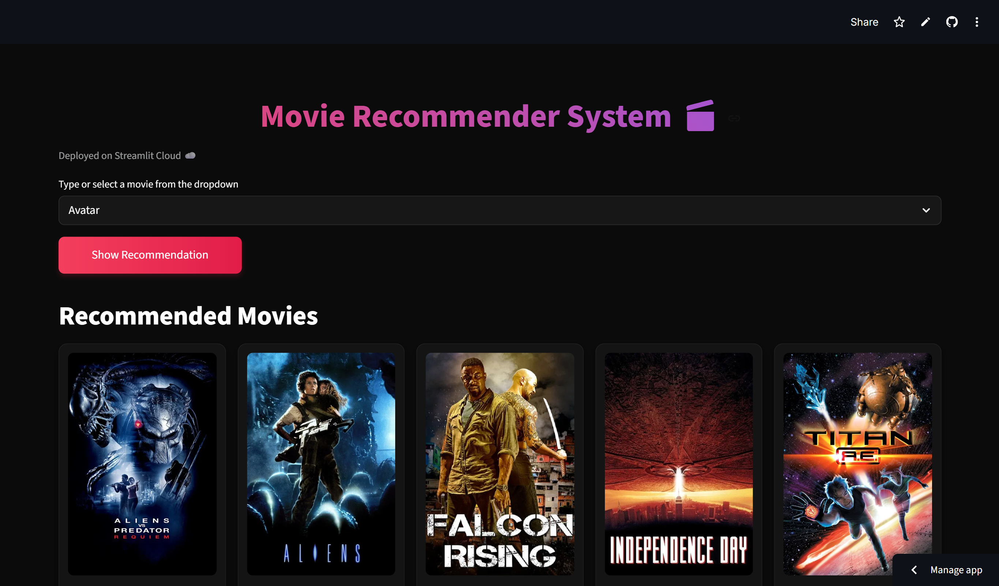

# 🎬 Movie Recommendation System

A content-based movie recommender system built using Machine Learning and deployed using Streamlit. It suggests similar movies based on user input using cosine similarity.

---

## 🚀 Live Demo
👉 [https://movierecommendersystem-mddbwodet93nbplckj9zmh.streamlit.app/]
---

## 📌 Project Overview

This project recommends movies based on similarity of content features like:
- Genres
- Keywords
- Cast
- Crew
- Overview

It uses Natural Language Processing and Machine Learning techniques to compute similarity between movies and return the most relevant recommendations.

---

## ⚙️ Features

- 🔍 Search any movie
- 🎯 Get top 5 similar movie recommendations
- 🎬 Display movie posters using TMDB API
- ⚡ Fast and lightweight recommendation engine
- 🌐 Fully deployed on Streamlit Cloud

---

## 🧠 How It Works

1. Movie dataset is preprocessed and cleaned
2. Important features are combined into a single text field
3. Text is converted into vectors using CountVectorizer / TF-IDF
4. Cosine similarity is calculated between all movies
5. Based on input movie, top similar movies are recommended

---

## 🛠️ Tech Stack

- Python 🐍
- Pandas
- NumPy
- Scikit-learn
- Streamlit
- TMDB API

---

## 📁 Project Structure

```bash
movie_recommender_system/
├── app.py
├── Movie Recommendation System.ipynb
├── requirements.txt
├── .gitignore
├── .streamlit/
│   └── secrets.toml
├── artifacts/
│   ├── similarity.pkl
│   └── movies.pkl
└── README.md
```

---

## 📸 Screenshots

### 🎬 Movie Recommendation System UI

<p align="center">
  
</p>

<p align="center"><b>Home Page - Movie Selection Interface</b></p>

<p align="center">
  
</p>

<p align="center"><b>Recommendation Results using ML Model</b></p>

---

## 📌 Note

This project uses TMDB API for fetching movie posters. Make sure you have a valid API key configured in Streamlit secrets.